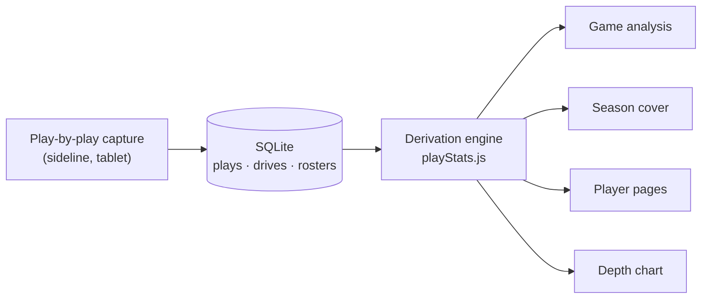

<div align="center">

# FirstRead

**Stats platform for American football clubs.**
Record the game play by play. Everything else computes itself.


</div>

---

## Record the game

Sixteen drives, 103 plays, one season. Every play carries down and distance, field position, the
players involved and the yardage — captured from the sideline on a tablet while the game is
running.


52px touch targets. A jersey-number grid instead of dropdowns. A stepper for yardage. The system
keyboard never opens, and one screen asks one question.

## Read the game

Four lenses over the same play log — the whole game, by down, by player, by drive. Change the lens,
not the data.


Yards per play, third-down conversion, red-zone efficiency, explosives, drive charts, per-player box
scores. Every rate prints its own fraction underneath. Small samples get flagged instead of averaged
away. No number in this app was ever typed in by hand.

## Build the roster


Offense, defense, specialists and coaching staff. Jersey number, position and unit belong to the
**season**, not the person — so a player changing number next year doesn't rewrite last year's box
score. Two-way players sit in both units without being duplicated. Paste a list to import a whole
squad.

## Run the club

Dues, payments, movements and collection status per player — who's paid, who's partial, who's 47
days overdue, and how much of the season's budget is actually in the account. The part of running an
amateur club that has nothing to do with football and eats a coach's week anyway.

---

## Why it exists

Hudl costs more than a lower-division club can pay, and it sells video. FirstRead skips video
entirely — that's Hudl's moat — and competes where it doesn't: **honest derivation**.

|  | FirstRead | Spreadsheet | Hudl |
|---|---|---|---|
| Cost to a Division II club | one licence | free | out of reach |
| Stats | derived from the play log | typed by hand | video-tagged |
| Correcting a play afterwards | fixes every number downstream | fix it in nine places | re-tag |
| Runs without an analyst | yes | technically | no |

## How it's built



Plays go in. Nothing else is ever stored. There is no `stats` table, no cached totals, and no
`score` column — the scoreboard itself is summed from the points on each play. One engine feeds
every screen, so two views can't disagree about the same game.

**Stack:** React + Vite · Express · SQLite compiled to WASM (`sql.js` — no native build, a coach
installs it without a toolchain) · raw SQL, no ORM · ~11k lines.

## The engine is in this repo

The derivation layer is here, extracted and standalone — [`src/`](src/), with
[33 tests](test/) and zero dependencies.

```bash
npm test     # tests 33 | pass 33 | fail 0
```

It's the part worth reading: a safety scores for the defending team, so the scoring side can't be
read off possession. Penalty yardage is excluded from a player's stats but not from the ball's
position. A sack is a pass play. A kickoff is not a drive. Each test names the failure it prevents.

The rest of the platform is private — it launches commercially in 2027.

---

<div align="center">

**Built for the coaching staff of an amateur club in Spain.**
Screenshots use demo data.

© 2026 Jose Clavel · All rights reserved · public to read, not licensed for reuse

</div>
